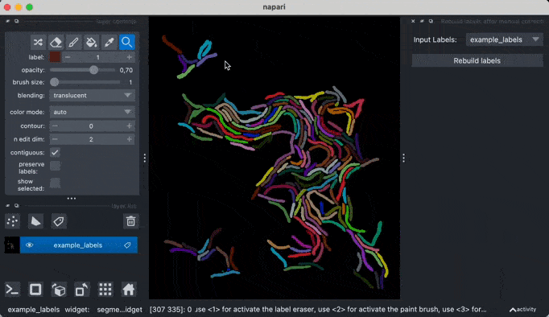

# napari-manual-labels-correction

Minimalistic plugin to rebuild labels (e.g. segmentation labels) after manual correction using napari's built-in labels manipulation tools.

We assume the following to be true about valid labels:
- labels are contiguous in space, i.e. for a given label
    there is only once connected component in the image

This function will attempt to rebuild labels such that the following
correction steps will be included in a valid output label map:
- under-segmentation: objects have been split by drawing a line
    between subsets of the original label
- additional objects: new objects have been added to the label
    map, using labels that are not necessarily unique
- output labels are contiguous in label space

  

----------------------------------

This [napari] plugin was generated with [Cookiecutter] using [@napari]'s [cookiecutter-napari-plugin] template.

<!--
Don't miss the full getting started guide to set up your new package:
https://github.com/napari/cookiecutter-napari-plugin#getting-started

and review the napari docs for plugin developers:
https://napari.org/stable/plugins/index.html
-->

## Installation

You can install `napari-manual-labels-correction` via [pip]:

    pip install napari-manual-labels-correction

To install latest development version :

    pip install git+https://github.com/m-albert/napari-manual-labels-correction.git

## Contributing

Contributions are very welcome. Tests can be run with [tox], please ensure
the coverage at least stays the same before you submit a pull request.

## License

Distributed under the terms of the [MIT] license,
"napari-manual-labels-correction" is free and open source software

## Issues

If you encounter any problems, please [file an issue] along with a detailed description.

[napari]: https://github.com/napari/napari
[Cookiecutter]: https://github.com/audreyr/cookiecutter
[@napari]: https://github.com/napari
[MIT]: http://opensource.org/licenses/MIT
[BSD-3]: http://opensource.org/licenses/BSD-3-Clause
[GNU GPL v3.0]: http://www.gnu.org/licenses/gpl-3.0.txt
[GNU LGPL v3.0]: http://www.gnu.org/licenses/lgpl-3.0.txt
[Apache Software License 2.0]: http://www.apache.org/licenses/LICENSE-2.0
[Mozilla Public License 2.0]: https://www.mozilla.org/media/MPL/2.0/index.txt
[cookiecutter-napari-plugin]: https://github.com/napari/cookiecutter-napari-plugin

[file an issue]: https://github.com/m-albert/napari-manual-labels-correction/issues

[napari]: https://github.com/napari/napari
[tox]: https://tox.readthedocs.io/en/latest/
[pip]: https://pypi.org/project/pip/
[PyPI]: https://pypi.org/
